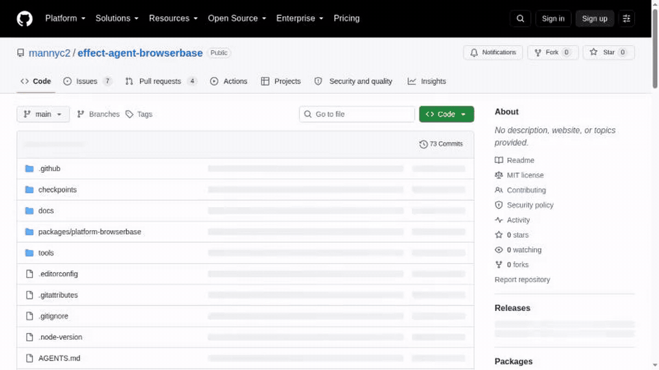
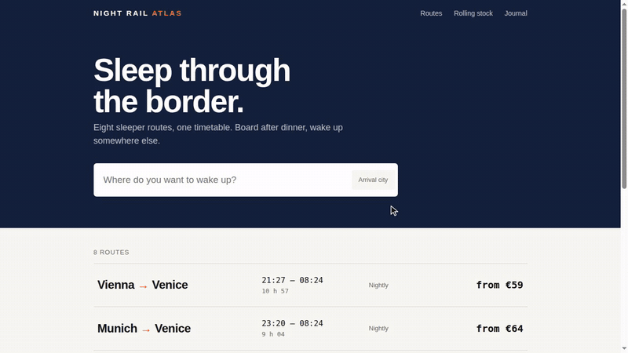

# Effect browser automation

Three packages share one scoped browser owner:

| Package                | Folder                                                       | Responsibility                                                                                                                                                                                |
| ---------------------- | ------------------------------------------------------------ | --------------------------------------------------------------------------------------------------------------------------------------------------------------------------------------------- |
| `effect-browser`       | [`packages/browser`](packages/browser/README.md)             | Provider-independent browser operations, typed bindings, live capture, page holds and the shared Playwright/CDP runtime. `effect-browser/chromium` launches or borrows self-managed Chromium. |
| `effect-browserbase`   | [`packages/browserbase`](packages/browserbase/README.md)     | Browserbase accounts/resources and hosted acquisition, cleanup, contexts, uploads, recordings and replays. Depends on the shared runtime.                                                     |
| `effect-agent-browser` | [`packages/agent-browser`](packages/agent-browser/README.md) | One Effect Agent adapter and maintained Toolkit for either browser source. Depends on the shared runtime and framework, not Browserbase.                                                      |

The `0.2.0-beta.0` package set was released from tag `v0.2.0-beta.0` through the [release workflow](docs/RELEASING.md), with provenance, on npm's `beta` dist-tag. `0.2.0-beta.1` is tagged `v0.2.0-beta.1`. `main` carries `0.2.0-beta.2`, the next coordinated version, and may be ahead of any release. Install by exact version or `@beta`: a prerelease never moves `latest`, which still points at a name reservation (`0.0.0-reserved.0`) for `effect-browser` and `effect-agent-browser` and at `0.1.0-beta.102` for `effect-browserbase`. The former two-package graph (`effect-browserbase` and `effect-agent-browserbase`) ended with `0.1.0-beta.104`.

Install the shared host runtimes explicitly. Browserbase requires `effect-browser@0.2.0-beta.2` as a peer; the Agent adapter requires that same browser peer and `effect-agent@0.1.0-beta.102`. Those exact prerelease relationships keep the qualified package set coordinated. The existing Effect peer range remains `^4.0.0-rc.115`, with rc.115 as the tested version. Playwright stays an optional exact `1.63.0` peer of `effect-browser`. Peer declarations cannot prevent every duplicate bundle or module evaluation: all callers must still use the same live runtime and session identity.

## Start a browser

```ts
import { NodeServices } from "@effect/platform-node";
import { Effect, Layer } from "effect";
import * as Browser from "effect-browser/browser";
import { BrowserPolicy } from "effect-browser/browser-data";
import { Chromium } from "effect-browser/chromium";

const program = Browser.scoped(Chromium.launch(BrowserPolicy.unrestricted()), (browser) =>
  Effect.gen(function* () {
    yield* browser.navigate({ url: "https://example.com" });
    return yield* browser.observe({ scope: "viewport" });
  }),
).pipe(Effect.provide(Chromium.layer().pipe(Layer.provide(NodeServices.layer))));
```

Browser Layers take Effect's `Crypto` from the host platform: `NodeServices.layer` here, `BunServices.layer` on Bun. For hosted acquisition, supply `BrowserbaseBrowser.open(policy)` with a Browserbase account and launch recipe. `Browser.scoped` supervises either source: it preserves the concrete session and typed callback errors, joins callback resources before closing the browser, and retains checked cleanup failures in the workflow's own final cause even when its body fails. An outer race can discard that cause; use the provider's `onCleanup` with a host-owned sink to retain receipt evidence outside the race. The [Browserbase workflow examples](packages/browserbase/examples/workflows.ts) show account/resource composition.

## Use the same tools with either source

```ts
import * as BrowserTools from "effect-agent-browser/tools";
import * as AgentRuntime from "effect-agent/agent-runtime";

// The host acquired browser through Chromium or Browserbase, in the active execution scope.
const result = BrowserTools.run(browser, AgentRuntime.run(agent, request), {
  maxControls: 32,
});
```

Every agent turn borrows that session. `BrowserTools.run` provides the maintained handlers, runs browser calls one at a time in the order the model declared them, and supervises both browser and host callback failures; the host still supplies its selected LanguageModel and other Agent services. An agent declares the tools it may see: the original five, optional reading, pointer/wheel, keyboard, option-selection, wait and form tools, and `_and_inspect` variants that return the page an action leaves behind. `BrowserTools.instructions(toolkit)` and `BrowserTools.policy(...)` give the agent instructions and policy that match its tools, and every host option is checked once, when the host is built. `Adapter.fromSession` remains available for the framework's `InteractiveBrowser` handle. The complete [Chromium example](packages/agent-browser/examples/chromium.ts) and [Browserbase example](packages/agent-browser/examples/agent.ts) use one shared agent definition.

## API migration

| Previous composition                                                   | Current API                                                                                                                                                             |
| ---------------------------------------------------------------------- | ----------------------------------------------------------------------------------------------------------------------------------------------------------------------- |
| Provider-specific `withBrowser(policy, options, use)`                  | `Browser.scoped(Chromium.launch(policy, options), use)` or the same combinator with `BrowserbaseBrowser.open`                                                           |
| `session.bind().navigate(request)` for ordinary selected-page work     | `session.navigate(request)` resolves selection when the Effect runs; `yield* session.retain` explicitly acquires a checked retained handle                              |
| `bind()` / `currentTarget` and `BoundTarget`                           | `retain: Effect<RetainedTarget, BrowserError>` and the shared `TargetOperations` interface; `target` remains metadata                                                   |
| `selectPage(id)` / `closePage(id)`                                     | Pass the exact `PageInfo`; selection returns `void`. `createPage` returns the created page's metadata without selecting it                                              |
| Synchronous `Adapter.fromSession(browser)` / `currentHandle`           | `yield* Adapter.fromSession(browser, { selection: "current" })` or explicit `"retained"`; one handle beside the original browser                                        |
| Select a page, perform work, then restore selection                    | `session.pinPage(page)` or `session.pinFrame(page, frame)` addresses that target without changing selection                                                             |
| `Tools.handlers(Adapter.fromSession(session))`                         | `Tools.handlers(session)`; use `Tools.run(session, program, options)` for handler provisioning and failure supervision                                                  |
| Manually acquire an interval just to consume frames                    | `Capture.stream(session, options)`; retain `Capture.start` for explicit snapshots and stop summaries                                                                    |
| `error.reason === "busy"`; optional dispatch evidence                  | `error.reason._tag === "Busy"` or `Effect.catchReason("BrowserError", "Busy", ...)`; `outcome` is required                                                              |
| Provider `status` / retry timing on the outer browser error            | `Provider` / `Transport` reason carries `status`; `RateLimited` carries `retryAfterMillis`; `Limit` carries actual dimension, maximum and observed facts                |
| Every host reason exposed to the model                                 | Thirteen action-oriented tool reasons plus unchanged dispatch outcome. `ToolHost.toolFailures` retains original structured errors, Tool names and bounded call IDs      |
| Concrete `closeChecked` succeeds with `undefined`                      | It returns the same frozen cleanup receipt as `close` after the existing ownership-specific check passes; the generic session contract still permits discarding success |
| `documentBoundaries` holds the first 64 boundaries of an interval      | It holds the latest 64, so a long live stream can still name what it shows; `documentBoundariesTruncated` means earlier ones were let go                                |
| `maxFrames` at most 64, `maxDurationMillis` at most 600000             | At most 1024 frames (still bounded by `maxBufferedBytes`) and six hours, so a consumer can hold frames for a delay and an interval can last a session                   |
| A hand-written `multipart/x-mixed-replace` writer for a live ``   | `Capture.multipart(frames)`: a random boundary per response, and each part closed by the next part's headers so a still page's last picture is shown                    |
| Capture `dropped`                                                      | `discarded = overflow + late + duplicates + rejected`, with disjoint components; `upstreamDrops` remains `"unknown"`                                                    |
| Helper parameter `BrowserSession` when it does not supervise callbacks | `AnySession` (`BrowserSession<unknown>`); keep supervisors generic in their callback error or concrete session                                                          |
| Five required binding bounds/mode fields                               | Omission defaults to one concurrent invocation, 64 KiB input/output, 10 seconds and `reject-call`; explicit values are validated                                        |
| A common navigation needs a different loading deadline                 | Optional `NavigateRequest.timeoutMillis`, 1–600000 ms, capped by remaining session lifetime; the model tool still accepts only URL                                      |
| Control kind/label/disabled only                                       | Optional checked/selected/inputType/required state, collected with defined native/ARIA semantics and rechecked on the same node                                         |
| Several model fill/click calls for one form                            | `session.fillForm` / `browser_fill_form`: one gated operation that submits only after every field was set and still holds                                               |
| Tool options checked on every call; `observedResultMaxBytes`           | Options checked once when the host is built; `resultMaxBytes` fits every result. See the [agent guide](packages/agent-browser/README.md#api-migration)                  |
| Browser Layers and `Allocation.scoped` required no platform service    | `Chromium.layer`, `BrowserbaseBrowser.layer`, `BrowserRuntime.make` and `Allocation.scoped` require Effect's `Crypto`, such as the platform's `NodeServices.layer`      |
| `maxActions` at most 1000, with no reading of what a session has used  | `BrowserPolicy.maxActions` accepts up to 1,000,000 (default 100), and `status.actions` reports `{ used, maximum }`; code that builds a `SessionStatus` supplies it      |

Keyboard tools are a separate opt-in through `keyboardToolkit`. Neither existing toolkit gains tools merely by installing the new handler layers.

These are the coordinated shape changes of `0.2.0-beta.0` through `0.2.0-beta.2`. `0.2.0-beta.2` raised the action allowance and added `status.actions`; `0.2.0-beta.1` added the latest-64 boundaries, the capture limits, `Capture.multipart`, `fillForm`, build-time tool options with `resultMaxBytes`, the required `Crypto` and two more tool reasons. Remove old retained and adapter members rather than mixing both APIs. Old page/frame IDs, metadata and handles become stale after reconnect; within the same known browser lifetime, re-list pages and match exactly one saved native `targetId`, then use fresh metadata. Never substitute title, URL, order or the old local ID for that match. Explicit generic applications of curried `Browser.scoped` use four outer parameters (`S, A, E2, R2`) and three returned parameters (`E, AE, AR`); ordinary inferred calls retain their syntax.

## Ownership and boundaries

A browser belongs to its Effect Scope, with one connection, action budget and capture/page-control registry. Hosted release/status checks and local process termination are different cleanup facts; both owners provide `closeChecked`, and both retain their full receipts. Borrowed closure disconnects only the borrowed connection.

Actions retain exact observed-node identity and distinguish `undispatched`, `rejected` and `unknown` outcomes. An uncertain mutation is never replayed. Callback errors and services remain typed. Credentials, endpoints, control facts and native diagnostics stay with the host.

Live capture supplies bounded JPEG frames and metadata from the same owner. `Capture.stream(browser)` acquires lazily and releases its interval when consumption finishes, fails or is interrupted. `Capture.start` gives hosts the explicit interval, metadata snapshots and final summary. A caller owns encoding and presentation. Browserbase recording and replay services have independent resource lifetimes. No second debugger connection or raw driver is exposed.

The implementation targets trusted Node/Bun hosts and supports only explicit `Unrestricted` network policy. Chromium launch supports Linux/macOS; borrowed attachment currently accepts concrete loopback CDP WebSockets. Native local validation and hosted-provider evidence are distinct; see [Status](docs/STATUS.md).

### Demo

A real hosted session navigating and scrolling under Effect Agent control, encoded by the caller from the live frame stream ([provenance](docs/media/README.md)):



[Higher-quality MP4](docs/media/hosted-demo.mp4)

And footage meant to be watched: a storyboard performed with a drawn pointer, paced typing and eased scrolling by [`examples/realistic-footage`](packages/browserbase/examples/realistic-footage/README.md), filmed against a local Chromium:



[Higher-quality MP4](docs/media/realistic-footage.mp4)

## Development

Read [Contributing](CONTRIBUTING.md), the applicable package guide and [AGENTS.md](AGENTS.md). The repository builds into a pinned upstream Effect Agent compatibility workspace. All three owned packages use one coordinated version; the upstream framework pins remain separate.

```sh
# Use pinned Node 24.14.1 and Bun 1.4.2.
bash tools/bootstrap.sh
cd .work/upstream/tree
./node_modules/.bin/vp run -F effect-browser check
./node_modules/.bin/vp run -F effect-browserbase check
./node_modules/.bin/vp run -F effect-agent-browser check
```

Package unit tests stay with their owners. Consumers test their own code through `effect-browser/testing`, which runs the real session owner over a scripted engine, and `effect-browserbase/testing`, which composes the real account and browser Layers over a scripted control plane; neither needs Chromium, Playwright or credentials, and neither establishes anything about a hosted provider. The repository's own regressions use the same entries: owner regressions run over the scripted engine in `packages/browser/test`, and provider regressions compose the real Browserbase Layers over `effect-browserbase/testing` in `packages/browserbase/test`. Installed-package consumers cover resources, Chromium, hosted browser integration, Chromium agents and hosted agents on both Node and Bun. Production import checks keep framework/provider dependencies out of the common runtime and Chromium process code out of its root.

Ordinary CI is unpaid and read-only. [Hosted checks](docs/HOSTED.md) and [publication](docs/RELEASING.md) require separate authorization. [Security](SECURITY.md) describes the host trust boundary. Historical releases and media evidence retain their original source identity in [Status](docs/STATUS.md).

MIT licensed.
